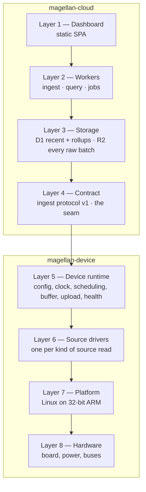
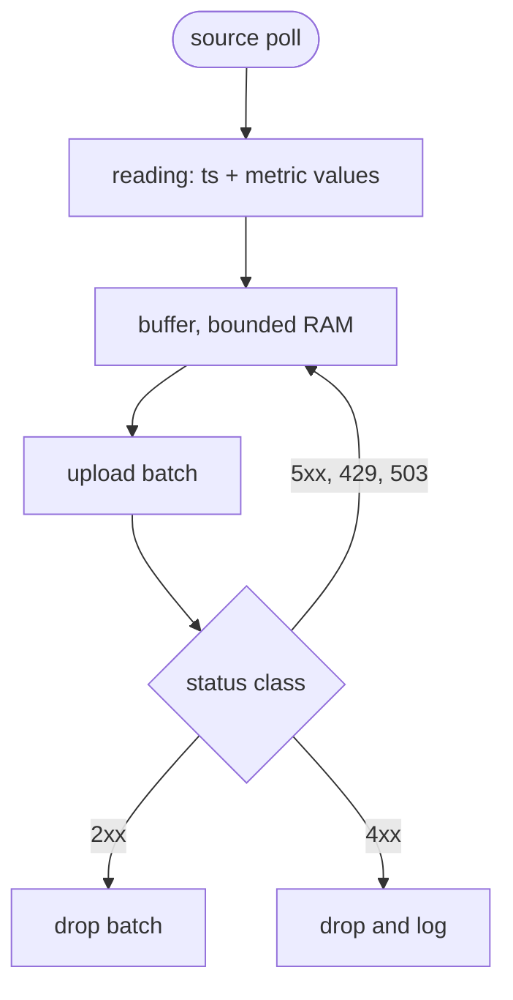

# Design

North star for the device half. What Magellan's device is aimed at, so a proposal, a ticket or a
diff can be checked against it.

- **Malleable until built.** Everything here is a hypothesis until code enacts it; change it freely,
  and the diff is the record. Only the deferral exemptions below are settled — the published
  contract, durable storage shapes, boundaries later code assumes — and those change through an ADR,
  never a quiet edit.
- **Scope.** If deferring a decision is cheap, it does not belong here. What stays is what the
  `AGENTS.md` deferral exemptions cover, plus the invariants those protect.
- **Present tense.** Stated as fact, including where no code enacts it yet.
- **On contradiction.** The cloud's `docs/DESIGN.md` and this document meet at the contract. Where
  they disagree about the seam, the contract document decides; where they disagree about the device,
  this one does.
- **Concise.** Guidance, not a check.

Vocabulary is `docs/CONTEXT.md`.

## 1. Purpose

Magellan's device reads small sources — a solar inverter over Modbus today, a current clamp tomorrow
— and uploads the readings to the cloud, which stores them so they can be charted later.

The device is where the variety lives; the cloud is deliberately dull. A device describes its own
sources and metrics in a manifest, and the cloud stores whatever the manifest declares. **The cloud
never learns a device-specific word.** A new kind of source is a change here, not a cloud deploy.

**The chain collapses at the seam.** A deployment may be several hops deep — an inverter the device
does not control, a board relaying through it, a transducer on its own pins — and the cloud sees
none of it: everything behind the uploading agent is declared as one of its sources (ADR 0010).

**No reading is lost.** Wi-Fi drops, the cloud is briefly down, the power cuts. These are the normal
case, not failures: the device buffers, retries, and the cloud absorbs the duplicate that inevitably
follows. Delivery is at-least-once; commitment is idempotent. The buffer is the only thing standing
between a poor connection and a hole in the record.

## 2. Constraints

A decision violating one is wrong.

**Bounded by the board.** RAM and flash are small, power may be a battery, and the device runs
unattended for months. A shape that assumes a server is wrong; the buffer and every schedule are
sized to the board, not to a datacentre.

**Two repositories, one seam.** The device and cloud halves are built, tested and deployed
independently. They meet only at the contract (Layer 4); nothing else crosses. The device reads the
cloud's published contract document and parses it natively, so neither side's toolchain constrains
the other.

**No data loss across the seam.** Outage handling is a property of the contract: **2xx** means
committed and the device may drop the batch · **4xx** means rejected, the device drops and logs —
**401 / 403** excepted, where a rejected credential keeps the buffer and retries with backoff ·
**429 / 503** means the cloud cannot commit now, the device retries with backoff and keeps its
buffer · **5xx or no response** means unknown state, retry; the duplicate is absorbed.

**One declaration per run.** The manifest is declared once, after which the run never declares
again. A batch naming a manifest the cloud has not stored is answered `503`, which the device reads
as any other outage: it keeps the buffer and backs off. A cloud that loses its declaration therefore
stalls the device until the device restarts — the contract has the status for the device to tell
that from a malformed batch (`422`), but the device does not yet act on it.

**Read-only toward the sources.** A source is read, never written. No source command, no register
write, no configuration push.

**Only the contract and the archive are durable.** The contract is what both repositories read; the
cloud's archive is the record. The device's buffer is a bounded queue, not a store — it exists to
survive an outage, and it may drop the oldest batch when it fills.

## 3. Layers

Numbered and named. `magellan-cloud` owns Layers 1–4; `magellan-device` owns Layers 5–8.



## 4. What it is, and isn't

- **A generic collector's producer.** The device describes its sources in a manifest; the cloud
  never needs to know an inverter from a clamp.
- **One binary over library crates.** One artifact to build, flash and reason about; the runtime,
  drivers and platform are wired by the binary, not by each other.
- **At-least-once, never exactly-once.** Exactly-once does not exist end to end. At-least-once
  delivery plus idempotent commitment is what is built.
- **Not a device command channel.** The contract runs one way — device to cloud. Control,
  configuration and OTA are out of scope.
- **Not a time-series store.** The buffer holds batches between outages; the cloud holds the record.

## 5. Invariants

1. **The cloud stores what the manifest declares, sight unseen.** The device may add a source or a
   metric without a cloud change, provided the manifest declares it.
2. **A manifest is versioned by hash.** The device hashes the exact bytes it sends; the cloud
   recomputes and returns the accepted hash in `ETag`, and the device asserts its own matches.
3. **A reading is one source poll** — a timestamp plus that source's metric values, not one item per
   metric.
4. **A batch is identified by `boot_id` and `seq` together.** `boot_id` is drawn once per boot;
   `seq` is monotonic within that boot and sent as a decimal string. The pair is never reused, so
   nothing has to survive a reboot; a gap in `seq` is visible and is a health signal, not a bug to
   hide.
5. **Commit is atomic per batch.** The device drops a batch only on `2xx` or `4xx`; every other
   outcome keeps it queued.
6. **A value is an integer with a decimal exponent; timestamps are UTC.** The physical value is
   `value × 10^exponent`, so the cloud stores integers and instants, never a float and never local
   time.
7. **The buffer is bounded on purpose.** When it fills, the oldest batch is dropped and `seq` leaves
   a visible gap rather than the device dying.
8. **The device issues no request the contract does not define.**
9. **One revocable token per device**, sent as `Authorization: Bearer`. The device holds its own
   credential and no other's.
10. **A batch that breaks a limit never reaches the buffer.** The device holds the contract's bounds
    and refuses its own malformed work; a `4xx` is not how it finds out.

## 6. The contract (Layer 4)

Orientation only; the published document is the authority. The contract is the cloud's OpenAPI
document — the endpoints below and the wire schemas. `crates/contract` is the native Rust reading of
those schemas; where the two disagree, the document wins and this crate is the bug.

```
PUT  /v1/devices/{id}/manifest
POST /v1/devices/{id}/batches
```

**Manifest** — the device's IANA time zone `tz`, and its sources and their metrics, with `kind`
(`gauge`, `counter`, `state`), and for anything measured a decimal `exponent` and, when it has one,
a `unit` — a state has neither. A counter may declare `resets` (`daily`); the boundary never crosses
the wire. `tz` cuts calendar days for reads; it never finds a reset or moves a timestamp off UTC.
Sent on boot and whenever sources change.

**Batch** — `manifest_hash`, `boot_id`, `seq`, an ordered `readings[]`, and a `heartbeat` carrying
uptime, buffer depth, battery, signal and firmware version. A batch names the manifest hash it was
read under, and the boot it was counted in.

The document bounds a reading's values with `minProperties`/`maxProperties`; the uniqueness of the
source ids and of each source's metric keys has no JSON Schema keyword and stays description text.

`crates/contract` also owns the SHA-256 over the manifest bytes. A byte-level canonical form is
gone: each side hashes the same bytes it sends and receives.

**The limits are mirrored, not inferred.** `crates/contract` carries its own copy of the contract's
bounds — counts, ranges, lengths, patterns, a manifest's bytes — and refuses a manifest or batch
that breaks one, uniqueness of source ids and metric keys included. The device's native integers
reach past what the cloud accepts in both directions that matter, so the type is not the bound. A
refusal is an operating error: journalled and dropped, never a panic. What the runtime built itself
it asserts instead. The mirror is checked against the published document.

## 7. Runtime (Layer 5)

- **Config** — device identity, endpoint, poll cadence, buffer bound. Unknown keys fail at startup.
- **Clock** — UTC wall time for reading timestamps, monotonic time for scheduling.
- **Scheduling** — poll each source on its cadence; batch, heartbeat and upload on theirs. Polling
  never waits on the network.
- **Buffer** — bounded, oldest-first, in RAM. A `seq` gap on overflow. Its bound is the device's own
  number; the batch's reading ceiling is the cloud's. Nothing it holds survives a reboot, and
  nothing needs to (ADR 8) — a spill to flash is deferred, not a seam held open.
- **Upload** — drain the buffer oldest-first, honoring the status classes; backoff on `429`/`503`
  and on a rejected credential. Each wait is spread inside its interval and the drained backlog is
  paced: an outage ends for the whole fleet at once, and a backoff every device follows identically
  makes the recovery a spike. The cloud is not required at start: polling begins and batches buffer
  while the manifest is declared, backed off exactly as a later outage is; only a refusal asking
  again cannot fix ends the run.
- **Health** — the heartbeat's account of the device: uptime, buffer depth, battery, signal.
- **Journal** — one diagnostic stream, its level the policy: `error` ends the run, `warn` lost or
  degraded something, `info` a state change or the pulse, `debug` inside one unit of work. To
  stderr, or the systemd journal under a unit. Records are machine data and never this (ADR 9).

## 8. Drivers (Layer 6)

One driver per kind of source, behind `driver::Source`: declare an `id` and its `metrics`, then poll
a `Reading`. The manufacturer's factor table stays in the driver, which folds a raw register into
the metric's integer value and `exponent`. The runtime knows nothing finer. Sofar-over-Modbus is the
first; a current clamp is next.

## 9. Platform (Layer 7)

`platform::Clock` and `boot_id` are the seam: wall and monotonic time, and the per-boot identity ADR
8 rests on. The network and the sleep come from the runtime's own dependencies, not from here, and
the buffer does not spill. One platform is built: Linux on 32-bit ARM. A second is a decision to
revisit, not a shape held open — the device is asynchronous and single-board on purpose.

## 10. Test seams

The device is proved against a fake cloud and fake sources, never against a board and never against
production. A fake lives in the crate that owns the seam it satisfies — the platform's clock, the
driver's source, the runtime's cloud — behind a `fake` feature a test enables as a dev-dependency.
The binary's end-to-end tests then reach the same fakes a crate's own tests use, and nothing written
for a test is reachable from a release build.

A fake behaves; it does not record calls. The fake cloud answers with a status class, and it is
where the outage handling of §2 is exercised as a whole rather than one branch at a time.

## 11. The path of a reading


